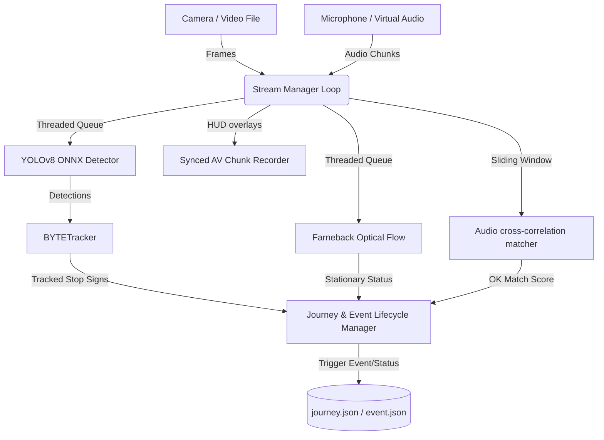

# Camera & Voice Alignment System - Feature Overview

This document provides a comprehensive summary of all core components and features implemented in the Camera & Voice Alignment codebase.

---

## 1. Core Architecture & Pipeline

The system is designed around a multi-threaded, asynchronous processing pipeline implemented in [stream_manager.py](file:///home/wot-rishabh/Rishabh/Working/R%26D/Camera_and_voice/streaming_workspace/managers/stream_manager.py). It decouples frame acquisition, neural network inference, dense optical flow calculation, audio chunk extraction, and video writing to maximize throughput and achieve real-time execution speeds.

---

## 2. Implemented Features

### 📡 1. Hardware Auto-Discovery & Probe (`DeviceManager`)
* Located in [device_manager.py](file:///home/wot-rishabh/Rishabh/Working/R%26D/Camera_and_voice/streaming_workspace/managers/device_manager.py).
* Checks system buses and interfaces to automatically locate available USB camera indexes (`/dev/video*`) and active ALSA soundcards.
* Writes findings dynamically to [devices.txt](file:///home/wot-rishabh/Rishabh/Working/R%26D/Camera_and_voice/streaming_workspace/devices.txt) so they can be loaded directly into configurations, reducing hardcoded hardware setup issues.

### 🔍 2. Real-Time Object Detection (`YOLOv8Detector`)
* Located in [pipeline.py](file:///home/wot-rishabh/Rishabh/Working/R%26D/Camera_and_voice/streaming_workspace/onnx_pipeline/pipeline.py).
* Performs object detection on input frames using a quantized YOLOv8/YOLO11 ONNX model.
* Utilizes **ONNX Runtime** for inference acceleration, automatically binding to **CUDA (GPU)** if available, with a fallback to **CPUExecutionProvider**.
* Implements multi-class Non-Maximum Suppression (NMS) and aspect-ratio preserving letterboxing.

### 👣 3. Multi-Object Tracking (`BYTETracker`)
* Located in [byte_tracker_model.py](file:///home/wot-rishabh/Rishabh/Working/R%26D/Camera_and_voice/streaming_workspace/byte_tracker/byte_tracker_model.py).
* Leverages high-confidence and low-confidence detection matching to track objects continuously across frames, handling brief camera dropouts or occlusions.
* Loads tracking parameters (`first_track_thresh`, `second_track_thresh`, `match_thresh`, `track_buffer`) dynamically from the configuration.

### 🚨 4. Journey & Event Lifecycle Management
* Implemented inside the processing loop of [stream_manager.py](file:///home/wot-rishabh/Rishabh/Working/R%26D/Camera_and_voice/streaming_workspace/managers/stream_manager.py).
* **Journey Creation**: When a stop sign is first tracked, a unique journey is registered in memory and saved to `journey.json` with a local system startup timestamp.
* **Event Capture**: When the tracked stop sign becomes stable ($\ge 3$ frames), the vehicle is stationary (verified by optical flow), and a voice match occurs at the same time interval, an event is logged in `event.json` and the journey status is updated to `"conducted"`.
* **Journey Finalization**: If a stop sign is no longer seen (allowing a 15-frame dropout grace period), the journey is closed, updating its `end_time` using the local system clock. If no event was captured, its final status is set to `"no event conducted"`.

### 🎙️ 5. sliding window Audio Correlation Matcher (`AudioMatcher`)
* Located in [audio_matcher.py](file:///home/wot-rishabh/Rishabh/Working/R%26D/Camera_and_voice/streaming_workspace/objects/audio_matcher.py).
* Captures raw PCM input via PyAudio/SoundDevice and runs a sliding window match against a template sound file (e.g., `ok.wav`).
* Computes normalized cross-correlation coefficients on normalized audio waveforms to identify sound alignment with millisecond accuracy.

### 💨 6. Dense Optical Flow Calculation
* Calculated inside the background thread in [stream_manager.py](file:///home/wot-rishabh/Rishabh/Working/R%26D/Camera_and_voice/streaming_workspace/managers/stream_manager.py).
* Computes **Farneback dense optical flow** on a localized Region of Interest (ROI) corresponding to the driving lane (e.g., bottom 60% of the frame).
* Integrates flow magnitude thresholds to reliably verify if the vehicle has fully stopped (stationary) or is in motion.

### 🎥 7. Synced HUD Video Recorder (`OpenCVHUDRecorder`)
* Located in [hud_recorder.py](file:///home/wot-rishabh/Rishabh/Working/R%26D/Camera_and_voice/streaming_workspace/objects/hud_recorder.py).
* Records real-time video frames overlaid with safety HUD panels directly into synchronized MP4 chunks.
* Implements automatic space management to clean up the oldest recording chunks when the total directory footprint exceeds a configured limit (e.g., 3000 MB).

### 🖥️ 8. High-Fidelity HUD Visualization & Live Indicators
* Located in [draw.py](file:///home/wot-rishabh/Rishabh/Working/R%26D/Camera_and_voice/streaming_workspace/utils/draw.py) and [stream_manager.py](file:///home/wot-rishabh/Rishabh/Working/R%26D/Camera_and_voice/streaming_workspace/managers/stream_manager.py).
* Renders bounding boxes, safety compliance statuses, average pipeline latencies, processing frame rates, and hardware delegates.
* Features a dedicated, static **Tracker Status Panel** on the top right:
  * **Journey Status Dot**: Turns **GREEN** when a stop sign is actively tracked, **RED** when inactive.
  * **Event Status Dot**: Turns **GREEN** once the compliance criteria are satisfied, and returns to **RED** when idle.

### 🔄 9. File Simulation Fallback Modes
* Enables debugging and logic validation on recorded files without live hardware.
* Employs virtual video demuxers (`VirtualVideoStream`) and virtual loopback audio playback (`FFplayAudioMonitor`) to simulate a live capture environment perfectly.

---

> [!NOTE]
> All timestamps logged in the tracking json outputs (`journey.json` and `event.json`) utilize the local system clock (with millisecond precision) instead of relative video frame times.